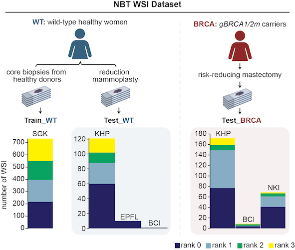
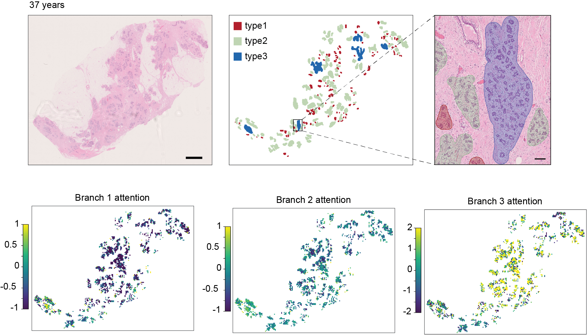

# **Multi-branch multiple-instance ordinal classification-based **_BreastAgeNet_** identified deviated tissue ageing in high-risk breast tissues**

[Paper]() | [Cite]()

**Abstract:** Assessing breast cancer risk in high-risk populations, such as women with germline BRCA1/2 mutations (_gBRCA1/2m_), is crucial for early detection and intervention. Abnormal tissue ageing has been associated with an increased risk of breast cancer in women with benign conditions. This study introduces **_BreastAgeNet_**, a computational framework designed to predict tissue ageing statuses (<35y, 35-45y, 45-55y, and >55y) in histologically normal breast tissue (NBT) using whole slide images (WSIs). Trained on 743 WSIs from usual-risk NBT, BreastAgeNet achieved a mean absolute error (MAE) of 0.59 on an external dataset of reduction mammoplasty cases. **_BreastAgeNet_** inherently offers high interpretability through attention heatmaps generated by its multi-branch architecture, which shows strong associations with manually annotated lobule types. Additionally, unsupervised analyses of reduced features extracted by **_BreastAgeNet_** unveiled distinct age-related microscopic changes, such as  more condensed epithelial cells, increased ductal involution, and enhanced collagen deposition. When applied to high-risk _gBRCA1/2m_ carriers and breast cancer patients, **_BreastAgeNet_** revealed a greater discrepancy (MAE of 0.895 and 0.888) between chronological age and predicted tissue ageing status, indicating accelerated ageing in _gBRCA1/2m_ carriers <35 years and delayed tissue ageing in breast cancer patients >55 years. These findings highlight **_BreastAgeNet's_** ability to capture the ageing trajectory in the normal breast while identifying deviations in high-risk individuals. This framework provides novel insights into early cancer initiation and offers significant potential for advancing precision prevention strategies in _gBRCA1/2m_ carriers.


## **_BreastAgeNet_** Walkthrough
**_BreastAgeNet_** is a computational pathology (CPath) framework designed to assess tissue ageing in NBT from WSI. It was developed and tested on WSIs of NBT across multiple cohorts and resources.
<p align="center">
     
</p>


The implementation can largely be broken down into the following steps:
- **Step 0**: Dataset pre-processing  
- **Step 1**: _BreastAgeNet_ training  
- **Step 2**: Visualization  
- **Step 3**: External testing  


### Step 0. Dataset preprocessing
The framework leverages advanced deep learning methods, incorporating a multi-branch multiple-instance learning (MIL) architecture to capture ordinal age-related histological alterations. For the framework, the pre-processing includes: 
#### Step 0.1: Patch preparation
This step will perform foreground tissue detection, patch tessellation and tissue type classification. For more details, please check our [_NBT-Classifier_].(https://github.com/SiyuanChen726/NBT-Classifier.git).
#### Step 0.2: Feature extraction
This step extracts visual features from randomly sampled patches using pre-trained feature extractors. 


### Step 1. _BreastAgeNet_ training 
The training was implemented using different configurations through 5-fold cross-validation, tuning factors including feature extractor, attention mechanism, tissue content, and bag size.

<p align="center">
    
</p>


### Step 2. Visualisation
#### Step 2.1 tSNE projection of the whole dataset
**_BreastAgeNet_**  learns ageing-related microscopic patterns in a data-driven manner, using a multi-head self-attention mechanism to prioritize relevant patterns for accurate branch predictions. By integrating information from multiple branches, the model enhances the robustness of its predictions and provides deeper insights into the nuanced ageing-related changes in NBT.
<p align="center">
    
</p>
#### Step 2.2 Attention heatmap for a single WSI
Moreover, **_BreastAgeNet_** provides attention heatmaps that can directly visualise ageing-related spatial heterogeneity across the tissue, with this variability showing strong associations with manually annotated, age-related lobule types. 
<p align="center">
    
</p>


### Step 3. External testing
In the context of ordinal classification, where errors between adjacent classes are considered less severe than those between more distant classes, **_BreastAgeNet_** demonstrated robust performance on WSIs of NBT derived from reduction mammoplasties, with only 9% severe misclassification. With its substantiated ability to model ageing trajectories in NBT, <i>BreastAgeNet</i> has revealed deviations between expected (chronological) and observed (predicted) tissue ageing in high-risk NBT from _gBRCA1/2_ mutation carriers or breast cancer patients. 


## Installation
To get started, clone the repository and install [RandStainNA](https://github.com/yiqings/RandStainNA.git) and other required dependencies. 
```
git clone https://github.com/SiyuanChen726/BreastAgeNet.git
cd BreastAgeNet
conda env create -f environment.yml
conda activate torch-env
```

## Implementation
WSI data is expected to be organised as follows:
```
prj_BreastAgeNet/
├── CLINIC/clinicData_all.csv
├── WSIs
│   ├── KHP/slide1.ndpi, slide2.ndpi ...
│   ├── NKI/slide1.mrxs, ...
│   ├── BCI/slide1.ndpi, ...
│   ├── EPFL/slide1.vsi, ...
│   └── SGK/slide1.svs, ...
```

For step 0.1: Patch preparation to get the corresponding mask and TC_mask, 
please check [HistoQC](https://github.com/choosehappy/HistoQC.git) and our [_NBT-Classifier_](https://github.com/SiyuanChen726/NBT-Classifier.git)

This step yields:
```
prj_BreastAgeNet/
├── WSIs/                     # Raw WSIs
├── QC/KHP/                   
│   ├── slide1_maskuse.png    # Mask for foreground tissue regions 
│   └── ...
├── Features/KHP/slide1/      
│   ├── slide1_TCmask.png     # Tissue classification mask
│   ├── slide1_patch.csv      # Patch-level metadata (tissue classification probabilities)
│   └── ...
```
Note: The slide1_patch.csv file contains important patch information, including coordinates on WSI, and confidence of containing epithelium contents

For step 0.2: Feature extraction, implement the following:
```
python extractFeatures.py \
  --WSIs /path/to/WSIs \
  --FEATURES /path/to/features \
  --model_name UNI \
  --stainFunc augmentation \
  --batch_size 32 \
  --num_workers 4
```
This step yields:
```
prj_BreastAgeNet/
├── WSIs
├── QC
├── Features/KHP
│   ├── slide1
│   │   ├── slide1_TCmask.png 
│   │   ├── slide1_patch.csv
│   │   ├── slide1_UNI_augmentation.h5
│   │   ├── slide1_gigapath_augmentation.h5
│   │   ├── slide1_iBOT_augmentation.h5
│   │   ├── slide1_ResNet50_augmentation.h5
│   │   ├── slide1_UNI_reinhard.h5
│   │   ├── slide1_gigapath_reinhard.h5
│   │   ├── slide1_iBOT_reinhard.h5
│   │   └── slide1_ResNet50_reinhard.h5
│   └── ...
```

For Step 1. _BreastAgeNet_ training, implement the following:
```
python main.py --config_name config_v3
```
This step yields:
```
prj_BreastAgeNet/
├── WSIs
├── QC
├── Features
├── models
│   │──epi0.9_UNI_250_MultiHeadAttention_fold4_bestModel.pt
│   │──epi0.9_UNI_250_MultiHeadAttention_fold4_trainvalCurves_testMAE0.53.png
│   └── ...
```

For Step 2. For visualisation, please refer to [notebook vis_tSNE](notebooks/vis_tSNE.ipynb) and [notebook vis_attention_heatmap](notebooks/vis_attention_heatmap.ipynb)

For Step 3. For external testing, please refer to [notebook inference](notebooks/inference.ipynb)


## **_BreastAgeNet_** future directions
**_BreastAgeNet_** can identify NBT with abnormal ageing process. Taking it further, attention heatmaps can pinpoint tissue regions responsible for 'mismatched' tissue ageing predictions. This approach opens the door to techniques like spatial transcriptomics, which could further elucidate molecular abnormalities at these sites—potentially identifying early indicators of cancer initiation.


## Acknowledgements

