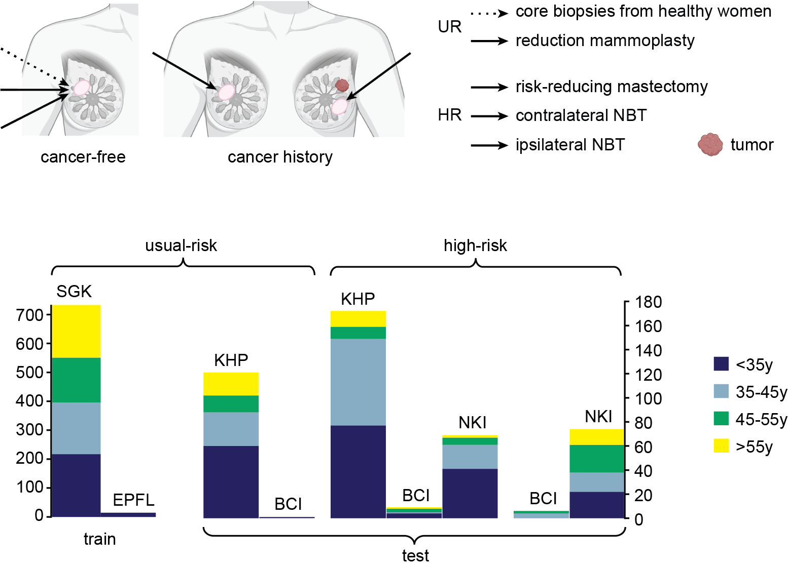
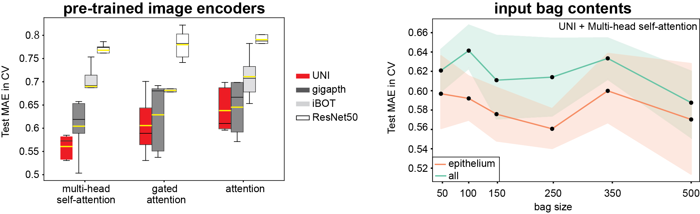

# **Multi-branch multiple-instance ordinal classification-based **_BreastAgeNet_** identified deviated tissue ageing in high-risk breast tissues**

**Abstract:** Assessing breast cancer risk in high-risk populations, such as women with germline BRCA1/2 mutations (_gBRCA1/2m_), is crucial for early detection and intervention. Abnormal tissue ageing has been associated with an increased risk of breast cancer in women with benign conditions. This study introduces BreastAgeNet, a computational framework designed to predict tissue ageing statuses (<35y, 35-45y, 45-55y, and >55y) in histologically normal breast tissue (NBT) using whole slide images (WSIs). Trained on 743 WSIs from usual-risk NBT, BreastAgeNet achieved a mean absolute error (MAE) of 0.59 on an external dataset of reduction mammoplasty cases. BreastAgeNet inherently offers high interpretability through attention heatmaps generated by its multi-branch architecture, which shows strong associations with manually annotated lobule types. Additionally, unsupervised analyses of reduced features extracted by BreastAgeNet unveiled distinct age-related microscopic changes, such as  more condensed epithelial cells, increased ductal involution, and enhanced collagen deposition. When applied to high-risk gBRCA1/2m carriers and breast cancer patients, BreastAgeNet revealed a greater discrepancy (MAE of 0.895 and 0.888) between chronological age and predicted tissue ageing status, indicating accelerated ageing in gBRCA1/2m carriers <35 years and delayed tissue ageing in breast cancer patients >55 years. These findings highlight BreastAgeNet's ability to capture the ageing trajectory in the normal breast while identifying deviations in high-risk individuals. This framework provides novel insights into early cancer initiation and offers significant potential for advancing precision prevention strategies in gBRCA1/2m carriers.


## **_BreastAgeNet_** Walkthrough
**_BreastAgeNet_** is a computational pathology (CPath) framework designed to assess tissue ageing in NBT from WSI. It was developed and tested on WSIs of NBT across multiple cohorts and resources.
<p align="center">
    
</p>


The implementation can largely be broken down into the following steps:
- **Step 0**: Dataset pre-processing  
- **Step 1**: _BreastAgeNet_ training  
- **Step 2**: Visualization  
- **Step 3**: External testing  


### Step 0. Dataset preprocessing
The framework leverages advanced deep learning methods, incorporating a multi-branch multiple-instance learning (MIL) architecture to capture ordinal age-related histological alterations. For the framework, the pre-processing includes: 
#### Step 0.1: Patch preparation
To detect foreground tissue regions, tessellated patches and tissue classification results.
#### Step 0.2: Feature extraction. 
patches are further converted into vectors using pre-trained image encoders. 
<p align="center">
    
</p>


### Step 1. _BreastAgeNet_ training 
The training was done using different configurations through 5-fold cross-validation. 
<p align="center">
    
</p>


### Step 2. Visualisation
#### Step 2.1 tSNE projection of the whole dataset
**_BreastAgeNet's_** multi-head self-attentions across multiple branches enable a more nuanced understanding of age-related changes in NBT.
<p align="center">
    
</p>

#### Step 2.2 Attention heatmap for a single WSI
Moreover, **_BreastAgeNet_** provides attention heatmaps that can directly visualise ageing-related heterogeneity across the tissue, with this variability showing strong associations with manually annotated, age-related lobule types. 
This suggests the model's ability to pinpoint localized ageing diversity, which can be important for understanding varied ageing processes within the same breast.
<p align="center">
    
</p>


### Step 3. External testing

<p align="center">
    
</p>

With its substantiated ability to model ageing trajectories in NBT, <i>BreastAgeNet</i> has revealed deviations between expected (chronological) and observed (predicted) tissue ageing in high-risk NBT from _gBRCA1/2_ mutation carriers or breast cancer patients. 
<p align="center">
    
</p>

Taking it further, attention heatmaps can pinpoint tissue regions responsible for 'mismatched' tissue ageing predictions. This approach opens the door to techniques like spatial transcriptomics, which could further elucidate molecular abnormalities at these sites—potentially identifying early indicators of cancer initiation.


## Installation
To get started, clone the repository and install the required dependencies. 
```
```
The empty folder is organised as follows:
```
prj_BreastAgeNet/
├── WSIs
│   ├── KHP/slide1.ndpi, slide2.ndpi ...
│   ├── NKI/slide1.mrxs, ...
│   ├── BCI/slide1.ndpi, ...
│   ├── EPFL/slide1.vsi, ...
│   └── SGK/slide1.svs, ...
```


## Implementation
For step 0.1: Patch preparation, implement the following to get the corresponding mask and TC_mask:
```

```
This step yields:
```
prj_BreastAgeNet/
├── WSIs
├── QC/KHP
│   ├── slide1/slide1_mask.png
│   └── ...
├── TC/KHP
│   ├── slide1/slide1_TCmask.png
│   └── ...
├── Features/KHP
│   ├── slide1/slide1_patch.csv
│   └── ...
```
For step 0.2: Feature extraction, implement the following:
```

```
This step yields:
```
prj_BreastAgeNet/
├── WSIs
├── QC
├── TC
├── Features/KHP
│   ├── slide1
│   │   ├── slide1_patch.csv
│   │   ├── slide1_UNI.h5
│   │   ├── slide1_gigapath.h5
│   │   ├── slide1_iBOT.h5
│   │   └── slide1_ResNet50.h5
│   └── ...
```
For Step 1. _BreastAgeNet_ training, implement the following:
```

```
This step yields:
```
prj_BreastAgeNet/
├── WSIs
├── QC
├── TC
├── Features
├── models
│   │──slide1_ResNet50.pt
│   │──slide1_ResNet50.pt
│   └── ...
```
For Step 2. For visualisation, please refer to the notebook.
For Step 3. For external testing, please refer to the notebook or implement the following:
```

```


