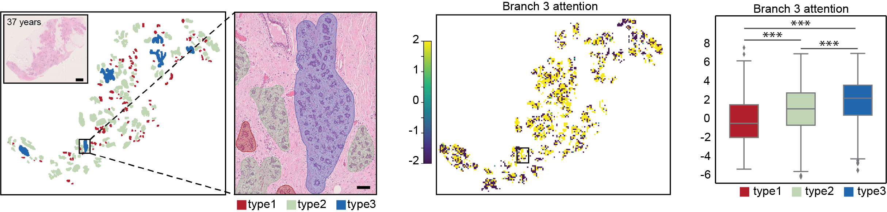

# Multi-branch multiple-instance ordinal classification-based _BreastAgeNet_ identified deviated tissue ageing in high-risk breast tissues


## Description
_BreastAgeNet_ is a computational model designed to assess tissue aging in histologically normal breast tissue (NBT) from whole slide images (WSIs).

The framework leverages advanced deep learning methods, incorporating a multi-branch multiple-instance learning (MIL) architecture to capture subtle age-related alterations in breast tissue. 

<center>
  
</center>


It provides an ordinal classification of tissue aging into four distinct categories: <35 years, 35-45 years, 45-55 years, and >55 years.

<center>
  
</center>


This enables a nuanced understanding of age-related changes in breast tissue through the attention mechanism from multiple branches. 

<center>
  
</center>


Moreover, _BreastAgeNet_ generates attention heatmaps that enhance interpretability, allowing clinicians to visualize and understand the regions of tissue most indicative of aging, offering transparency in the decision-making process.
<figure style="text-align:center;">
  
</figure>


BreastAgeNet has demonstrated the ability to detect age-related deviations in high-risk groups, including gBRCA1/2 mutation carriers and breast cancer patients. These findings could provide valuable insights into the early stages of cancer initiation, supporting precision prevention strategies tailored to high-risk individuals and potentially informing early intervention or surveillance efforts.


## Table of Contents
1. [Installation](#installation)
2. [Usage](#usage)
3. [Contributing](#contributing)
4. [License](#license)
5. [Acknowledgments](#acknowledgments)


## Installation

To get started, clone the repository and install the required dependencies.

### Clone the repository

```bash
git clone https://github.com/yourusername/your-repo-name.git
cd your-repo-name

python3 -m venv venv
source venv/bin/activate  # On Windows, use `venv\Scripts\activate`
pip install -r requirements.txt


### 5. Usage

Provide clear instructions on how to use your project, including code examples if necessary.

```markdown
## Usage

Once the environment is set up, you can start using the tool.

### Running the model

To train the model on your data, use the following command:

```bash
python train_model.py --data_dir /path/to/data --epochs 10


python visualize_results.py --model_path /path/to/model


